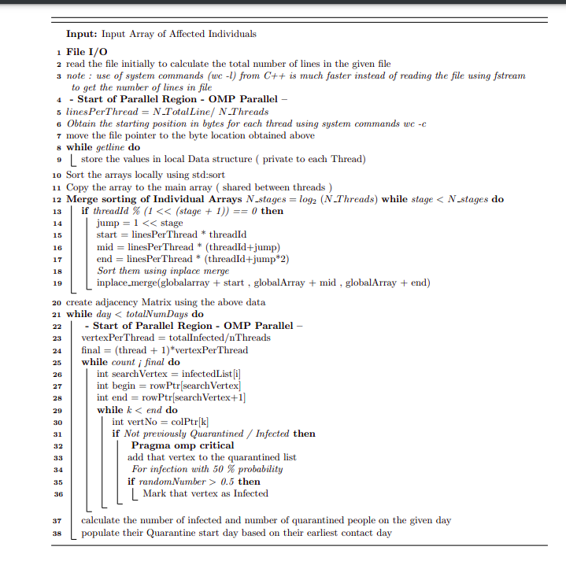

# OpenMP - CUDA based Asynchronous contact tracing algorithm for graphs

Problem Objective
-----------------

Implement a contact tracing algorithm which could trace back and
identify the infected people based on a graph based contact tracing
algorithm.The contact tracing is done for all those who have come in
contact with these people in the past 10 days. at the end of every day,
half of the people (generated randomly) who are quarantined test
positive. Hence people who have come in contact with these quarantined
and tested positive people in the previous days are also contact traced
and quarantined

Parallel Methodology
---

Three parallel approaches have been proposed for this graph based
ocntact tracing approach. they are as mentioned below

-   Purely OpenMP based contact Tracing algorithm

-   Cuda + OpenMP based contact tracing algorithm

-   Cuda + OpenMP based contact tracing algorithm using CUDA streams

### File I/O Parallelization - OpenMP 
---

The File I/O takes up most of the execution time in the given problem
which makes it necessary to parallelise the process. The I/O process
involves two main process , one is the actual data transfer from file to
the program and other is the sorting of entries based on their row index
in order to construct the adjacency matrix of the system.\
The Parallelization proposed using OpenMP is as following ,

-   Parallel read of input file using multiple threads. This is done by
    displacing the file pointer of each thread according to its line
    number , which is obtained using shell commands

-   The data read by individual threads are sorted using STL sort and
    copied to a common global array

-   The GLobal Array is hierarchically merge sorted by threads to form
    the final sorted array which is used to create the adjacency matrix.

### OpenMP Contact Tracing Parallelism
---

-   The Infected vertices after each day is shared among each of the
    threads equaly ( as possible )

-   Each thread traverses the adjaceny matrix based on its share of
    infected vertex and updates the infectedList

-   The contact identified vertices are classified as INFECTED based on
    a random number generator . If the value of random number is greater
    than 0.5 , then the vertex is marked as infected

-   All other sub process like identifying the count of infected
    vertices at end of each day has been parallelised using openMP

### OpenMP + CUDA Contact Tracing Parallelism 
---

-   The File I/O is performed using OpenMP parallelisation

-   One block of thread is spanned with minimum(1024,numInfected)
    threads, such that each thread takes care of each infected vertex (
    when nInfected $<$ 1024 ) or nInfected/1024 vertices if nInfected
    $>$ 1024

-   At start of each Day's iteration , the graph data is transfered to
    the GPU using blocking data transfer from host to device.

-   infected vertices which are newly at end of each day is sent to GPU
    where as the old infected vertices are stored in GPU itself which
    eliminates the need to transfer the whole infected list at end of
    every day

-   After end of each iteration , the updated quarantinedFlaglist is
    copied back from device to the Host ( Blocking Communication ) which
    is used to get the updated Infected List at host.

-   The kernel function is written is such a way to avoid thread
    divergence as much as possible as there is no conditional statements
    in the kernel function which might cause the same

-   The algorithm is modified in such a way that , all the conditional
    statements in identifying the state of the vertex are made in CPU
    and only the traversal is made in GPU

### OpenMP + CUDA Contact Tracing Parallelism 
---

-   The process is same as the previous OpenMP + Cuda Method , where we
    wil be using CUDA streams to overlap data transfer with computations

-   Each Day is assigned to a cuda stream and process are tracked using
    their stream id's

-   when the Kernel Call for Day \"N\" is executed in GPU , the required
    data for day \"N+1\" is Asynchronously copied to the GPU there by
    overlaping the GPU computation with data transfer

-   Further, Some data transfers are made in such a way to overlap the
    CPU process also

-   All Data Transfer in this method are done only using Asynchronous
    data transfer only ( cuda Streams ) and no blocking data transfer is
    made.

### OpenMP Algorithm 
---

### OpenMP + CUDA Algorithm
---

### OpenMP + CUDA Streams

Experimental Setup
------------------

For this Experimentation, thread sizes of 2, 4, 6, 8, 16, 32, 64 are
explored and the cuda thread block size is kept as 1. The following are
the experimentation that needs to be performed

1.  To visualise the growth of infected people as traced by the
    Algorithm

2.  To compare file read time of sequential and Parallel Method's ( File
    I/O )

3.  To compare execution time of contact tracing for sequential vs
    Parallel Execution for various thread sizes

4.  To compare the execution time of OpenMP vs CUDA based contact
    Tracing algorithm

5.  To compare the efficiency of the the CUDA implementation ,
    with/without the cuda Streams

6.  To explore the parallelism achieved in OpenMP using Intel's V-Tune
    Profiler

7.  To explore the parallelism achieved in CUDA using nvprof.

All the Timings for OpenMP parallel execution was obtained using
omp\_get\_wtime().All the Timings for Cuda parallel execution was
obtained using clock\_gettime(). All the readings are taken as average
of three separate readings. All the results are sanity checked with the
result from sequential Algorithm.

The Following are the Specifications of the hardware and the compiler
used to perform the experiments

### Turing Cluster - Head Node 

  S.No   Item              Description
  ------ ----------------- -------------------------------------------
  1      Processor         8-core AMD Opteron 3380 processor@ 2.6GHz
  2      RAM               32GB RAM
  3      Number of Cores   80

### Tesla System- CMG,CDS-IISc 

  S.No   Item                Description
  ------ ------------------- ------------------------------------------
  1      Processor           Intel(R) Xeon(R) Gold 6150 CPU @ 2.70GHz
  2      RAM                 160 GB
  3      Number of Cores     18
  4      NUmber of Threads   36
  5      Base Frequency      3.70 GHz
  6      L3 Cache            25 MB

Results
-------

### Contact Tracing of Infected Persons

-   As per the given graph , almost all the 1.7 Million people have been
    infected at the back tracing of 3rd day itself.

-   it is due to the fact that some of the vertices have more than 200K
    edges ( contact with other people ) which is the reason for the
    obtained result

### Contact Tracing of Infected Persons - Max Contact Restricted to 30 per vertex

To get a practically feasible contact graph, the maximum contact that
each vertex can make is restricted to 30 . i.e, of all the edges that an
infected vertex has only its first 30 of its edges are considered as
contact vertices.

*This assumption and modification is made only for this visualisation
only, it is not made in any other speedup validations*

{width="15cm" height="8cm"}

### Quarantine Start Time - Max Contact Restricted to 30 per vertex

The following graph provides the histogram of number of people , who's
quarantine starts on the kth day.\
*This assumption and modification is made only for this visualisation
only, it is not made in any other speedup validations*

AS per the Graph, most of the people have contacted with the infected
people on DAY 1 itself , so their quarantine period will start from Day
0.

### Comparision of File I/O - Sequential vs OpenMP Parallel

The following graph provides the speedup of filereadtime ( per single
file ) for various openMP threads.

{width="15cm" height="8cm"}

-   One of the main reason for the Dip in speedup at 32 threads may be
    due to the fact that the head node of Turing has only 8 physical
    cores or 16 threads, So any additional threads spanned will be added
    as an over head to existing processors.

### Thread occupancy - Analysis 
---

The following analysis was performed on Tesla ( CMG ) using intel's
VTune Profiller. The following figure shows the total number of time (
in sec ) that given n number of threads were occupied.

-   The 8 thread figure shows that for more than 80% of the CPU time, 8
    threads were active and for the 16 thread run, all 16 threads were
    active for about 50 % of the CPU time, which shows a decent thread
    occupancy figures for the proposed algorithm.

### Cuda W/O streams vs CUDA streams 
---

The speedup is measured against both the sequential version which is
compiled using \"-O3\" flag and the results are given below.The
following execution was performed on Tesla system

### CUDA TimeLine - with/without Streams
---

The following figure shows the timeline of the events that occurred in
GPU during the execution. The analysis was performed in the Tesla system
( CMG ) using Nvidia Profiler ( nvprof ).

-   AS we could see from both the figures, the data transfer for N+1^th^
    graph to the GPU has been overlapped by the N^th^ day kernel
    Computation

*Note : The CPU part of the execution is not displayed , since nvprof
does not support CPU profiling of multiple threads*

### OpenMP vs CUDA W/O streams vs CUDA streams 
---

The following chart shows the speedup ratio's for all three
parallelisation schemes. The first one shows the speedup excluding the
File I/O time and the later including the File I/O time.The speedup is
measured against the sequential version compiled with the \"-O3\"
optimisation flag for the first plot and without the \"-O3\" flag for
the second plot. The following execution was performed on Tesla system .

## Observation
---

-   the usage of OpenMP for file I/O operations significantly increased
    the speedup of the entire process

-   It is also observed that the use of Asynchronous Data transfer in
    CUDA ( non Blocking ) reduces the execution time significantly

-   For contact tracing, The OpenMP performs better than both The CUDA
    counterparts. This **might** be due to the fact that the contact
    tracing process has low arithmetic intensity ( less flops per data
    transferred ). SO the computations performed inside the kernel are
    outweighed by the overhead of data transfer that comes along with it
    ( even with the asynchronous data transfer ) .
